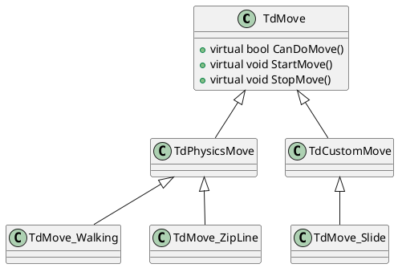

镜之边缘是一款以跑酷作为核心玩法的游戏，也是我心目中最优秀的跑酷游戏。尽管该游戏至今已经有十多年的历史，但依然难有后辈游戏能够在跑酷系统上超越它。作为一款跑酷为核心的游戏，镜之边缘的TraversalSystem构建的不可谓不优秀，优秀的表现，流程的手感，不愧是老Dice的技术力。Locomotion也是本人日常工作的核心内容，所以非常好奇镜之边缘是如何构建这样优秀的TraversalSystem。

StillAlive是镜之边缘这款游戏的民间导出版本，基于Unity和C#实现，关于TraversalSystem的实现，基于参照了原始游戏的版本。简单分析StillAlive的代码，能够很好的了解到类似镜之边缘这样的游戏，一套优秀的TraversalSystem是如何构建的。

一个TraversalSystem，可以从某种程度上分成两部分：一部分是逻辑层，负责各个运动行为的表现和切换；另一部分则是物理层，在不同的运动状态下，所执行不同的物理运动逻辑。后文也会基于上述的思路从两个部分拆解StillAlive中的运动系统。

------

#### TdMove逻辑行为
TdMove用于实现在不同运动状态下，执行不同的游戏逻辑，类似于TurnInPlace，Slide，Climb等等。所有的运动状态被细分拆解成一系列的TdMove，从而能够以OOP的方式组织代码。TdMove以类型数组的方式存储在角色对象上（Pawn），数组的索引和枚举值一一对应，从而能够取出对应的TdMove类，执行后续实例化逻辑。大致代码如下：
```csharp
public enum EMovement
{
	MOVE_None,
	MOVE_Walking,
	MOVE_Falling,
	MOVE_Grabbing,
	// ..... 
	MOVE_BotGetDistance,
    MOVE_Cutscene,
	MOVE_MAX
};
class Pawn
{
	// 当前运动状态的枚举值
    public TdPawn.EMovement MovementState;
    [repnotify] public TdPawn.EMovement ReplicatedMovementState;

	// TdMove的类
	public array<TdMove> MoveClasses = new array<TdMove>() {
		default,
		ClassT<TdMove_Walking>(),
		ClassT<TdMove_Falling>(),
		ClassT<TdMove_Grab>(),
		// .......
		ClassT<TdMove_Cutscene>(),
	}
	
	// TdMove的实例对象，由MoveClasses构建
	public array<TdMove> Moves;
};
```
可以从代码中看到，Pawn中还存储了当前MovementState（MovementState同时是网络复制对象），可以想到TdMove以类似于FSM的形式去触发，在StillAlive中TdPawn_SetMove会设置当前MovementState，并执行对应TdMove的进入和退出逻辑，同时标记网络复制对象，从而可以同步到各个模拟端。
```csharp
class Pawn
{
    public bool TdPawn_SetMove(EMovement NewMove, bool _bViaReplication)
    {
		if(_bViaReplication)
        {
            // ...
        }
        else
        {
	        // 执行上一个TdMove的退出逻辑
            if(((int)MovementState) != ((int)TdPawn.EMovement.MOVE_None/*0*/))
            {
                Moves[((int)MovementState)].StopMove();
            }

            OldMovementState = ((TdPawn.EMovement)MovementState);
            MovementState = ((TdPawn.EMovement)NewMove);

			// 执行上一个TdMove的PostStop
            if(((int)OldMovementState) != ((int)TdPawn.EMovement.MOVE_None/*0*/))
            {
                Moves[((int)OldMovementState)].PostStopMove();
            }

			// 标记网络复制
            ReplicatedMovementState = ((TdPawn.EMovement)NewMove);
            SetNetUpdateTime(WorldInfo.TimeSeconds - ((float)(1)));

			// 执行新的Move逻辑
            Moves[((int)MovementState)].StartMove();

			// 分发NewMove的事件
            NotifyNewMove();
        }
	}
};
```
现在看看TdMove本身的一些实现，结构上大致和传统FSM的State类似，核心是StartMove和StopMove。StillAlive中TdMOve的实现要复杂很多，其将大量的基础通用逻辑都实现在了TdMove基类中。*ps: 也许更好实践是将通用函数实现到静态工具类中，类似于MoveUtils之类的。*
```csharp
// 仅列出核心的几个函数
class TdMove
{
	// 当前Move能否执行
	public virtual bool CanDoMove()
    {
	    // 检测行为冷却
	    if((LastStopMoveTime > 0.0f) && RedoMoveTime > (CurrentWorldTime - LastStopMoveTime))
	    {
		    return false;
		}
		// 检测玩家状态(死亡)
		if (!CheckPawnStatus())
		{
			return false;
		}
		
		return true
    }

	public virtual void StartMove()
    {
	    // 基类的StartMove提供了一些通用的配置，类似于禁止移动，关闭碰撞等等
		PawnOwner.SetIgnoreMoveInput(DisableMovementTime);
        PawnOwner.SetIgnoreLookInput(DisableLookTime);
	    PawnOwner.SetCollision(true, bDisableCollision, default(bool?));
	    PawnOwner.LookAtRelease()
	}
	
	public virtual void StopMove()
    {
	    // 通用清除行为，恢复StartMove时的一些设置，恢复碰撞，取消禁止移动
		PawnOwner.StopIgnoreLookInput();
		PawnOwner.StopIgnoreMoveInput();
		// ...
    }
};
```
TdMove作为基类，更多的实现了一些通用的配置逻辑，用于在Move开始和结束时，设置角色的一些通用状态（碰撞、动画）。其实从这里也可以看出，TdMove相比于后文会讲到的PhysBehavior，更倾向于为表现层逻辑。即执行这个Move时，角色需要做处于什么状态，播什么动画，相机执行什么行为，可以理解为一种MovementAbility。如果放在现在的UE5中去实现类似的系统，GameAbilitySystem会是一套合适的框架，这个后续可以延申一下。

现在我们需要知道StillAlive在何时去调用TdPawn_SetMove，显而易见的思路就是检测当前条件，触发对应行为。更具体的说法就是，收集角色当前状态信息和通用的环境信息，根据优先级依次去检测各个Move的条件。从这里引申出来的两个重要的问题，一是如何更方便的配置不同优先级的检测序列，另外一个则是如何优化检测的效率，这里每个问题都可以展开述说，但是先搁置不谈。

回到StillAlive中，触发SetMove的情况大致分为四部分：
- TdMove本身逻辑去设置下一个Move的类型。例如爬梯子过程中，解除到地面，手动切换到MOVE_Walking
- PhysicsVolume，如LadderVolume、ZiplineVolume，当Pawn接触到PhysicsVolume会尝试设置对应的Move
- PlayerMoveManager，一个巨大的FSM，处理在不同的MovementState时对特定MovementAction（后续探讨这个概念）的响应，在响应的过程中会设置特定的TdMove。
- CheckAutoMoves，最核心的部分，CheckAutoMoves发生在TdPawn的performPhysics中，即实际物理运动之前。CheckAutoMoves会基于角色当前位置和运动趋势，向前方检测障碍物的信息，判断障碍物是否满足特定行为的需求，列如VaultOver，WallClimbi等等。这类行为往往也会影响到后续的PhysBehavior。
- 
基于上述四个部分，就可以囊括StillAlive中所有Move相关的逻辑。从这四个部分去进一步分析代码，就能够更清晰地了解到StillAive地TraversalSystem地实现。

镜之边缘的Move行为非常丰富，在进一步分析更多的TdMove之前，先简单看一下StillAlive中TdMove的继承链：


#### Physics物理运动

```csharp
public virtual unsafe void startNewPhysics(FLOAT deltaTime, INT Iterations)
{
	if ( (deltaTime < 0.0003f) || (Iterations > 7) )
		return;

	switch (Physics)
	{
		case PHYS_None         : return;
		case PHYS_Walking      : physWalking(deltaTime, Iterations); break;
		case PHYS_Falling      : physFalling(deltaTime, Iterations); break;
		case PHYS_Flying       : physFlying(deltaTime, Iterations); break;
		case PHYS_Swimming     : physSwimming(deltaTime, Iterations); break;
		case PHYS_Spider       : physSpider(deltaTime, Iterations); break;
		case PHYS_Ladder       : physLadder(deltaTime, Iterations); break;
		case PHYS_RigidBody    : physRigidBody(deltaTime); break;
		case PHYS_SoftBody     : NativeMarkers.MarkUnimplemented(); break;
		case PHYS_Interpolating: physInterpolating(deltaTime); break;
		default:
			setPhysics(PHYS_None);
			break;
	}
}
```

未完待续。。。
------

  
参考：

[1] [Mirror's Edge Decompiled](https://www.eideren.com/posts/mirrors-edge-decompiled.html)